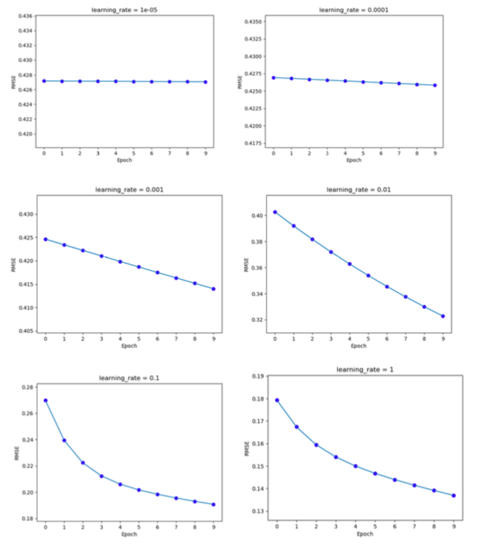

# I   Love    Python

Welcome to my page, all the codes are written by Layla Yuan; 

Hope you enjoy the time.

## Regression

The _Regression.py_ calculates the different **RMSE** under different learning rates in 10 epochs; The learning rate varies from 1e-05 to 1.

The plots below shows the variation of the RMSE under different learning rates.

### Conclusion

After 10 epochs, all RMSEs decrease, but the speeds of decreasing are different as of different learning rates:

1. When the learning rate equals to 0.00001 or 0.0001, the learning rate is so small that the RMSE decreases slowly;

2. When the learning rate increases, the speed of the decrease of RMSE increases accordingly. When the learning rate is 0.01 or 0.1, the speed of the decrease of RMSE maximums, the RMSE reduces around 0.08 after 10 epochs.

## Decision Tree

