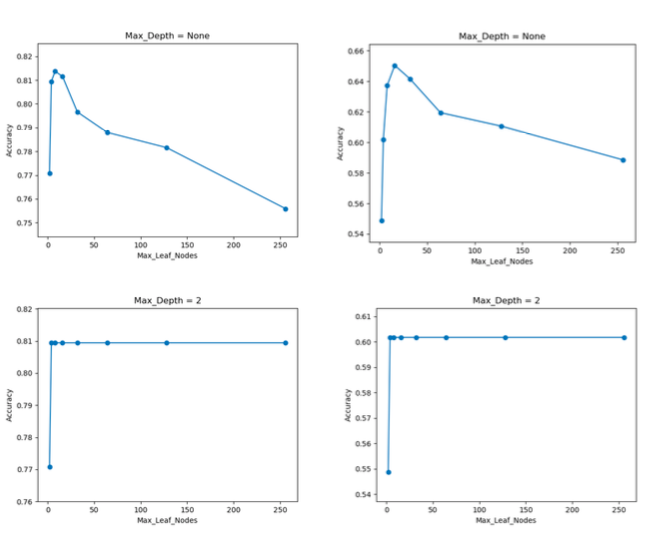

# I   Love    Python

Hello everyone, welcome to my page, I share some of my python codes which are related to **Data Science** and **Machine Learning** here. Hope to get feedback from you and communicate with you :) 

Thanks for your time

## Regression

  The _Regression.py_ under _regression_ folder calculates the different **RMSE** under different learning rates in 10 epochs; The learning rate varies     from 1e-05 to 1.

  The plots below shows the variation of the RMSE under different learning rates.

### Conclusion

  After 10 epochs, all RMSEs decrease, but the speeds of decreasing are different as of different learning rates:

  1. When the learning rate equals to 0.00001 or 0.0001, the learning rate is so small that the RMSE decreases slowly;

  2. When the learning rate increases, the speed of the decrease of RMSE increases accordingly. When the learning rate is 0.01  or 0.1, the speed of the decrease of RMSE maximums, the RMSE reduces around 0.08 after 10 epochs.

  

## Decision Tree

  The _DecisionTree.py_ under _DecisionTree_ folder uses decision tree models in **machine learning** to predict the classification of the test dataset based on the information obtained from the training dataset. 

  The plots below depicts the trends of the accuracies of predictions with different max delpths

  — The left plots are generated by original data set which is biased towards one of the target value - Not Very Late;

  — The right plots are generated by pruned data set which has the same number of two target value - Very Late and Not Very Late.

### Conclusion

  **Horizontal Comparison** :

  1. when the values of Max_Depth are same, the trends of Accuracy Lines are similar;
  
  2. The accuracies of left-plots are bigger than those of right-plots; but we cannot make the conclusion that the model generated by biased data is better than that by pruned data as the biased data has larger data set number.

  **Vertical Comparison** :
  
  1. When max_nodes_leaf equals 4, the accuracy maximums, then as the max_nodes_leafs increases, the accuracy decrease or remain unchanged;

  2. When the max_depth is equal to 2, the accuracy remains constant after obtaining the maximum value; while with other max_depth values, the accuracies decrease after obtaining the maximum value;

  3. The biggest accuracy values are very close under different Max_Depth

## Cluster

The _cluster.py_ under _Cluster_ folder shows how to perform **Dendrogram** and **K-Means** in python. 

The plot below shows the hierarchical clusters, for dendrogram, the number of clusters is determined manually, if we chose distance = 3 as threshold, we will get 3 clusters.

The plots below show the clusters after several iterations, the process will stop either the new centroids and old centroids are converged or after finishing the last iteration set in advance.

### Conclusion

The centroids are fixed after 8 iterations.

